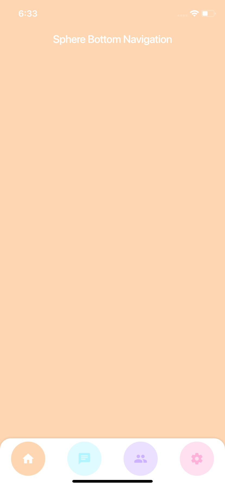

# Sphere Bottom Navigation Bar

**Sphere Bottom Navigation Bar is flutter package, You can create beautiful awesome degined bottom navigation bar with importing this library**

## Getting Started

### 1.  Add the dependencies to [pubspec.yaml]
```yaml
dependencies:
   sphere_bottom_navigation_bar: ^0.0.3
```
---
###  2.  Install it
You can install packages from the command line:
```shell
$ flutter packages get
```
---


### 3. Import package
```dart
import  'package:sphere_bottom_navigation_bar/sphere_bottom_navigation_bar.dart';
```
---
###  4.  Example: 

```dart
bottomNavigationBar: SphereBottomNavigationBar(  
  defaultSelectedItem: 0,  
  sheetRadius: BorderRadius.only(  
      topLeft: Radius.circular(20), topRight: Radius.circular(20)),  
  onItemPressed: (index) => setState(() {  
        print('Selected item is - $index');  
      }),   
  navigationItems: [  
    BuildNavigationItem(  
      tooltip: 'Home',  
  itemColor: Color(0xFFFFD6B2),  
  icon: Icon(Icons.home),  
  selectedItemColor: Color(0xFFFFD6B2),  
  ),  
  BuildNavigationItem(  
      tooltip: 'Chat',  
  itemColor: Color(0xFFB2F4FF),  
  icon: Icon(Icons.chat),  
  selectedItemColor: Color(0xFFB2F4FF),  
  ),  
  BuildNavigationItem(  
      tooltip: 'Peoples',  
  itemColor: Color(0xFFCDB2FF),  
  icon: Icon(Icons.people),  
  selectedItemColor: Color(0xFFCDB2FF),  
  ),  
  BuildNavigationItem(  
        tooltip: 'Settings',  
  itemColor: Color(0xFFFFB2D9),  
  icon: Icon(Icons.settings),  
  selectedItemColor: Color(0xFFFFB2D9)),  
  ],  
),
```

# Screenshots 





